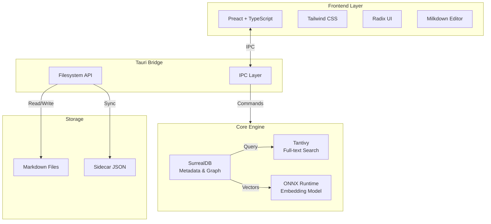
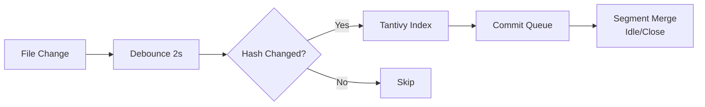
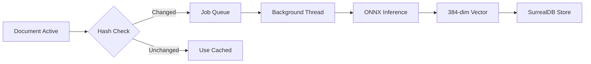

# Document Orchestrator - Implementation Roadmap

## Executive Summary

Bu belge, Document Orchestrator projesinin sprint bazlı implementasyon planını, risk değerlendirmesini ve kaynak tahminlerini içerir. Proje; yerel dosya sistemi üzerinde çalışan, doküman yaşam döngüsünü yöneten ve anlamsal benzerlik analizi sunan hafif bir desktop uygulamasıdır.

---

## 1. Proje Özeti

### 1.1 Sistem Mimarisi



### 1.2 Teknoloji Stack

| Katman | Teknoloji | Versiyon |
|--------|-----------|----------|
| Frontend | Preact | 10.x |
| Styling | Tailwind CSS | 3.x |
| UI Kit | Radix UI | 1.x |
| Editor | Milkdown | 7.x |
| Framework | Tauri | 1.x |
| Runtime | Rust | 1.75+ |
| Database | SurrealDB (embedded) | 1.x |
| Search | Tantivy | 0.21+ |
| ML | ONNX Runtime (ort) | 1.x |

---

## 2. Sprint Planı

### Sprint 0: Foundation & Setup (Week 1-2)

**Hedef**: Geliştirme ortamının kurulumu ve proye iskeletinin oluşturulması

#### 2.1.1 Altyapı Kurulumu

| Görev | Açıklama | Kabul Kriteri |
|-------|----------|---------------|
| TAURI-001 | Tauri projesi oluşturma | `cargo tauri dev` çalışır durumda |
| PREACT-001 | Preact + TypeScript entegrasyonu | Hot reload aktif, build hatasız |
| TAILWIND-001 | Tailwind CSS konfigürasyonu | Utility class'lar çalışıyor |
| RUST-001 | Rust workspace yapılandırması | `cargo build` başarılı |

#### 2.1.2 Proje Yapısı

```
axiom/
├── src-tauri/
│   ├── src/
│   │   ├── main.rs              # Entry point
│   │   ├── commands/            # Tauri commands
│   │   ├── core/                # Business logic
│   │   ├── db/                  # SurrealDB layer
│   │   ├── search/              # Tantivy integration
│   │   ├── ml/                  # ONNX Runtime
│   │   └── fs/                  # Filesystem watcher
│   └── Cargo.toml
├── src/
│   ├── components/              # UI components
│   ├── hooks/                   # Custom hooks
│   ├── stores/                  # State management
│   ├── services/                # API calls
│   └── types/                   # TypeScript types
├── docs/
└── tests/
```

#### 2.1.3 CI/CD Pipeline Kurulumu

| Görev | Açıklama | Kabul Kriteri |
|-------|----------|---------------|
| CI-001 | GitHub Actions workflow | PR'da otomatik build ve test |
| CI-002 | Rust linting (clippy) | Zero warnings policy |
| CI-003 | TypeScript type checking | `tsc --noEmit` başarılı |
| CI-004 | Dependabot konfigürasyonu | Otomatik dependency güncellemeleri |

**Kilometre Taşı**: Developer environment ready - herhangi bir geliştirici `git clone` sonrası 5 dakika içinde çalışır ortama sahip olur.

---

### Sprint 1: Core Data Layer (Week 3-4)

**Hedef**: Dosya sistemi entegrasyonu ve metadata yönetiminin temel altyapısı

#### 2.2.1 Filesystem Abstraction

| Görev | Açıklama | Risk | Öncelik |
|-------|----------|------|---------|
| FS-001 | Workspace dizini tespiti | Düşük | Yüksek |
| FS-002 | Dosya CRUD operasyonları | Orta | Yüksek |
| FS-003 | Atomic write implementasyonu | Yüksek | Yüksek |
| FS-004 | Sidecar JSON senkronizasyonu | Orta | Yüksek |
| FS-005 | File watcher (debounced) | Orta | Orta |

#### 2.2.2 Metadata Schema

| Görev | Açıklama | Kabul Kriteri |
|-------|----------|---------------|
| META-001 | Document struct tanımı | `id`, `title`, `status`, `path`, `created_at`, `updated_at` alanları |
| META-002 | Status enum: draft/active/superseded/archived | Validasyon çalışıyor |
| META-003 | Sidecar JSON serialization | `serde` ile okuma/yazma |
| META-004 | Metadata migration strategy | Schema değişikliklerinde geriye uyumluluk |

#### 2.2.3 SurrealDB Integration

| Görev | Açıklama | Risk | Öncelik |
|-------|----------|------|---------|
| DB-001 | Embedded SurrealDB başlatma | Yüksek | Yüksek |
| DB-002 | Graph schema: documents tablosu | Düşük | Yüksek |
| DB-003 | Graph edges: supersedes, references | Düşük | Yüksek |
| DB-004 | Vector storage için field tanımı | Orta | Orta |

**Kilometre Taşı**: Bir Markdown dosyası oluşturulabilir, metadata'sı kaydedilebilir ve dosya sistemi ile senkronize çalışır.

---

### Sprint 2: Search Engine (Week 5-6)

**Hedef**: Tantivy entegrasyonu ve tam metin arama özelliği

#### 2.3.1 Tantivy Integration

| Görev | Açıklama | Risk | Öncelik |
|-------|----------|------|---------|
| SEARCH-001 | Tantivy index oluşturma | Düşük | Yüksek |
| SEARCH-002 | Index schema tanımı | Düşük | Yüksek |
| SEARCH-003 | IndexWriter batch işleme | Orta | Yüksek |
| SEARCH-004 | Segment merge optimizasyonu | Yüksek | Orta |
| SEARCH-005 | Index rebuild mekanizması | Orta | Orta |

#### 2.3.2 Search API

| Görev | Açıklama | Kabul Kriteri |
|-------|----------|---------------|
| API-001 | Full-text search query | 10,000 dokümanda <100ms |
| API-002 | Status bazlı filtreleme | `status:draft` syntax çalışıyor |
| API-003 | Tag bazlı filtreleme | `tag:important` syntax çalışıyor |
| API-004 | Highlighting (snippet) | Aranan kelimeler vurgulanıyor |

#### 2.3.3 Search Pipeline



**Kilometre Taşı**: Kullanıcı arayüzünden arama yapılabilir ve sonuçlar 100ms içinde görüntülenir.

---

### Sprint 3: Semantic Analysis (Week 7-8)

**Hedef**: ONNX Runtime entegrasyonu ve embedding bazlı benzerlik önerileri

#### 2.4.1 ONNX Integration

| Görev | Açıklama | Risk | Öncelik |
|-------|----------|------|---------|
| ML-001 | `ort` crate entegrasyonu | Yüksek | Yüksek |
| ML-002 | Model download ve caching | Orta | Yüksek |
| ML-003 | Paraphrase-multilingual model yükleme | Yüksek | Yüksek |
| ML-004 | Embedding generation pipeline | Orta | Yüksek |
| ML-005 | Background thread yönetimi | Orta | Yüksek |

#### 2.4.2 Similarity Engine

| Görev | Açıklama | Kabul Kriteri |
|-------|----------|---------------|
| SIM-001 | Cosine similarity hesaplama | Matematiksel doğruluk |
| SIM-002 | Similarity threshold (0.75) | Configurable |
| SIM-003 | Similar document suggestion | En fazla 5 öneri |
| SIM-004 | Embedding lazy loading | Sadece ihtiyaç anında çalışır |

#### 2.4.3 ML Pipeline



**Kilometre Taşı**: Yeni bir doküman kaydedildiğinde, sistem benzer dokümanları önerebilir.

---

### Sprint 4: User Interface (Week 9-10)

**Hedef**: Kullanıcı arayüzünün tamamlanması ve etkileşimli deneyim

#### 2.5.1 Component Library

| Görev | Açıklama | Risk | Öncelik |
|-------|----------|------|---------|
| UI-001 | Radix UI component entegrasyonu | Düşük | Yüksek |
| UI-002 | Custom theme (Monolith) | Orta | Yüksek |
| UI-003 | Glassmorphism efektleri | Düşük | Orta |
| UI-004 | Status indicator component | Düşük | Yüksek |
| UI-005 | Document card component | Düşük | Yüksek |

#### 2.5.2 Layout & Navigation

| Görev | Açıklama | Kabul Kriteri |
|-------|----------|---------------|
| LAYOUT-001 | 3-panel layout (Library/Feed/Deck) | Responsive |
| LAYOUT-002 | Sol panel - Document list | Virtual scroll 10k+ items |
| LAYOUT-003 | Orta panel - Search results | Infinite scroll |
| LAYOUT-004 | Sağ panel - Orchestration deck | Collapsible |

#### 2.5.3 Editor Integration

| Görev | Açıklama | Risk | Öncelik |
|-------|----------|------|---------|
| EDITOR-001 | Milkdown editor entegrasyonu | Orta | Yüksek |
| EDITOR-002 | Markdown WYSIWYG | Düşük | Yüksek |
| EDITOR-003 | Auto-save (debounced) | Orta | Yüksek |
| EDITOR-004 | Read-only mode (superseded) | Düşük | Orta |

#### 2.5.4 Command Palette

| Görev | Açıklama | Kabul Kriteri |
|-------|----------|---------------|
| CMD-001 | Cmd+K shortcut | Global hotkey |
| CMD-002 | Spotlight-style UI | Blur overlay |
| CMD-003 | Quick actions | Create, Search, Navigate |

**Kilometre Taşı**: Kullanıcı doküman oluşturabilir, düzenleyebilir, arayabilir ve benzer doküman önerilerini görebilir.

---

### Sprint 5: Document Lifecycle (Week 11-12)

**Hedef**: Doküman yaşam döngüsü yönetimi ve ilişki sistemi

#### 2.6.1 Lifecycle Management

| Görev | Açıklama | Risk | Öncelik |
|-------|----------|------|---------|
| LIFE-001 | Status transition logic | Düşük | Yüksek |
| LIFE-002 | Superseded workflow | Orta | Yüksek |
| LIFE-003 | Archive workflow | Düşük | Orta |
| LIFE-004 | Draft validation | Düşük | Orta |

#### 2.6.2 Relationship Management

| Görev | Açıklama | Kabul Kriteri |
|-------|----------|---------------|
| REL-001 | Explicit relationships UI | Drag-drop veya seçim |
| REL-002 | Supersedes edge creation | Graph DB'de kayıt |
| REL-003 | References edge creation | Bidirectional |
| REL-004 | Lineage visualization | Mini timeline/chart |

#### 2.6.3 Graph Visualization

| Görev | Açıklama | Risk | Öncelik |
|-------|----------|------|---------|
| GRAPH-001 | Mini graph component | Orta | Orta |
| GRAPH-002 | Node interactions | Düşük | Orta |
| GRAPH-003 | Relationship highlighting | Düşük | Orta |

**Kilometre Taşı**: Kullanıcı doküman durumlarını değiştirebilir ve dokümanlar arası ilişkiler kurabilir.

---

### Sprint 6: Error Handling & Resilience (Week 13-14)

**Hedef**: Hata yönetimi, recovery ve sistem sağlamlığı

#### 2.7.1 Error Scenarios

| Görev | Açıklama | Risk | Öncelik |
|-------|----------|------|---------|
| ERR-001 | Disk full handling | Yüksek | Yüksek |
| ERR-002 | Missing file detection | Orta | Yüksek |
| ERR-003 | Corrupted file handling | Orta | Yüksek |
| ERR-004 | Invalid UTF-8 handling | Düşük | Orta |
| ERR-005 | ONNX crash fallback | Yüksek | Yüksek |

#### 2.7.2 Recovery Mechanisms

| Görev | Açıklama | Kabul Kriteri |
|-------|----------|---------------|
| REC-001 | Ghost entry UI | "Missing" badge + actions |
| REC-002 | Relocate document | Path update dialog |
| REC-003 | Refresh library | Full re-sync button |
| REC-004 | Safe shutdown | Pending commits flush |

#### 2.7.3 Logging & Monitoring

| Görev | Açıklama | Risk | Öncelik |
|-------|----------|------|---------|
| LOG-001 | Structured logging (tracing) | Düşük | Orta |
| LOG-002 | Error telemetry (opt-in) | Orta | Düşük |
| LOG-003 | Performance metrics | Düşük | Orta |

**Kilometre Taşı**: Sistem tüm hata senaryolarına zarif bir şekilde tepki verir ve kullanıcıya anlamlı geri bildirim sağlar.

---

### Sprint 7: Testing & Quality Assurance (Week 15-16)

**Hedef**: Kapsamlı test kapsamı ve kalite güvencesi

#### 2.8.1 Rust Unit Tests

| Görev | Açıklama | Kabul Kriteri |
|-------|----------|---------------|
| TEST-001 | Core business logic tests | %80 coverage |
| TEST-002 | Database layer tests | Integration tests |
| TEST-003 | Search engine tests | Tantivy integration |
| TEST-004 | ML pipeline tests | Mock ONNX tests |

#### 2.8.2 Integration Tests

| Görev | Açıklama | Risk | Öncelik |
|-------|----------|------|---------|
| E2E-001 | Tauri E2E tests | Yüksek | Yüksek |
| E2E-002 | File system operations | Orta | Yüksek |
| E2E-003 | Search & filter flows | Orta | Yüksek |
| E2E-004 | Document lifecycle flows | Orta | Yüksek |

#### 2.8.3 Performance Tests

| Görev | Açıklama | Kabul Kriteri |
|-------|----------|---------------|
| PERF-001 | 10k document load test | <100ms search |
| PERF-002 | Memory usage profiling | <500MB idle |
| PERF-003 | CPU usage profiling | %0-1 idle, spike acceptable |

**Kilometre Taşı**: Tüm kritik path'ler test edilmiş, CI/CD pipeline'da otomatik çalışıyor.

---

### Sprint 8: Packaging & Distribution (Week 17-18)

**Hedef**: Uygulamanın paketlenmesi ve dağıtım kanallarının hazırlanması

#### 2.9.1 Build Configuration

| Görev | Açıklama | Risk | Öncelik |
|-------|----------|------|---------|
| BUILD-001 | Release build optimization | Yüksek | Yüksek |
| BUILD-002 | Binary size optimization | Orta | Orta |
| BUILD-003 | Code signing | Yüksek | Yüksek |
| BUILD-004 | Auto-updater integration | Orta | Orta |

#### 2.9.2 Platform Support

| Görev | Açıklama | Kabul Kriteri |
|-------|----------|---------------|
| PLATFORM-001 | macOS build (Intel + Apple Silicon) | Universal binary |
| PLATFORM-002 | Windows build | MSI installer |
| PLATFORM-003 | Linux build (AppImage + deb) | Major distros |

#### 2.9.3 Distribution

| Görev | Açıklama | Risk | Öncelik |
|-------|----------|------|---------|
| DIST-001 | GitHub Releases workflow | Düşük | Yüksek |
| DIST-002 | Homebrew formula | Orta | Düşük |
| DIST-003 | Website & documentation | Orta | Orta |

**Kilometre Taşı**: Kullanıcılar GitHub Releases'ten indirerek uygulamayı çalıştırabilir.

---

## 3. Risk Değerlendirmesi

### 3.1 Teknik Riskler

| Risk | Olasılık | Etki | Risk Skoru | Mitigasyon |
|------|----------|------|------------|------------|
| ONNX Runtime entegrasyon zorluğu | Orta | Yüksek | 6 | Erken POC, fallback mekanizması |
| Tantivy index corrupt olması | Düşük | Yüksek | 4 | Atomic writes, backup strategy |
| SurrealDB embedded stability | Orta | Orta | 4 | Sidecar JSON sync, migration plan |
| Large document performance | Orta | Orta | 4 | Lazy loading, pagination |
| Cross-platform filesystem farkları | Yüksek | Orta | 6 | Tauri abstraction layer kullanımı |

### 3.2 Proje Riskleri

| Risk | Olasılık | Etki | Risk Skoru | Mitigasyon |
|------|----------|------|------------|------------|
| Scope creep | Yüksek | Yüksek | 9 | Strict backlog management |
| Gecikme riski | Orta | Orta | 4 | Buffer sprint'leri |
| Kaynak kısıtlaması | Düşük | Yüksek | 3 | Önceliklendirme, MVP focus |

---

## 4. Kaynak Tahmini

### 4.1 Geliştirici Roller

| Rol | Sprint'ler | Görevler |
|-----|------------|----------|
| Rust Developer | 0-8 | Core engine, Tauri commands, database layer |
| Frontend Developer | 0, 4-7 | Preact UI, state management, editor integration |
| DevOps Engineer | 0, 7-8 | CI/CD, packaging, distribution |
| QA Engineer | 6-7 | Test yazımı, test otomasyonu |

### 4.2 Bağımlılıklar

| Kategori | Araç/Servis | Maliyet |
|----------|-------------|---------|
| Code Signing (macOS) | Apple Developer | $99/yıl |
| Code Signing (Windows) | Certificate Authority | ~$200/yıl |
| GitHub Actions | GitHub-hosted runners | Ücretsiz (public repo) |
| Error Telemetry | Sentry (opsiyonel) | Ücretsiz tier |

---

## 5. Kabul Kriterleri (Definition of Done)

Her sprint için genel kabul kriterleri:

1. **Kod Kalitesi**: Clippy zero warnings, TypeScript strict mode
2. **Test Coverage**: Yeni kod için minimum %70 unit test coverage
3. **Dokümantasyon**: Public API'ler için rustdoc, UI için README
4. **Review**: En az bir code review onayı
5. **CI/CD**: Tüm pipeline'lar yeşil

---

## 6. Backlog Öğeleri (Önceliklendirilmiş)

### P0 (Kritik - MVP)

- [ ] Tauri + Preact altyapısı
- [ ] Filesystem CRUD operasyonları
- [ ] Metadata yönetimi (SurrealDB)
- [ ] Full-text search (Tantivy)
- [ ] Temel UI (3-panel layout)
- [ ] Doküman editörü (Milkdown)
- [ ] Doküman lifecycle (draft/active/archived)

### P1 (Önemli - V1.0)

- [ ] Semantic similarity (ONNX)
- [ ] Relationship management (supersedes/references)
- [ ] Command palette
- [ ] Graph visualization
- [ ] Error handling & recovery
- [ ] Cross-platform builds

### P2 (İsteğe Bağlı - Sonraki)

- [ ] Plugin sistemi
- [ ] Cloud sync (opsiyonel)
- [ ] Advanced analytics
- [ ] Collaborative features

---

## 7. Takvim Özeti

| Sprint | Başlangıç | Bitiş | Focus |
|--------|-----------|-------|-------|
| 0 | Week 1 | Week 2 | Foundation |
| 1 | Week 3 | Week 4 | Data Layer |
| 2 | Week 5 | Week 6 | Search |
| 3 | Week 7 | Week 8 | ML/Semantic |
| 4 | Week 9 | Week 10 | UI |
| 5 | Week 11 | Week 12 | Lifecycle |
| 6 | Week 13 | Week 14 | Resilience |
| 7 | Week 15 | Week 16 | Testing |
| 8 | Week 17 | Week 18 | Release |

---

## 8. Ekler

### 8.1 SurrealDB Schema

```surrealql
-- Documents table
DEFINE TABLE documents SCHEMAFULL;
DEFINE FIELD id ON documents TYPE record;
DEFINE FIELD title ON documents TYPE string;
DEFINE FIELD status ON documents TYPE string
  ASSERT $value INSIDE ["draft", "active", "superseded", "archived"];
DEFINE FIELD path ON documents TYPE string;
DEFINE FIELD content_hash ON documents TYPE string;
DEFINE FIELD embedding ON documents TYPE array;
DEFINE FIELD tags ON documents TYPE array;
DEFINE FIELD created_at ON documents TYPE datetime;
DEFINE FIELD updated_at ON documents TYPE datetime;

-- Relationships
DEFINE TABLE supersedes SCHEMAFULL;
DEFINE FIELD in ON supersedes TYPE record(documents);
DEFINE FIELD out ON supersedes TYPE record(documents);
DEFINE FIELD created_at ON supersedes TYPE datetime;

DEFINE TABLE references SCHEMAFULL;
DEFINE FIELD in ON references TYPE record(documents);
DEFINE FIELD out ON references TYPE record(documents);
DEFINE FIELD created_at ON references TYPE datetime;
```

### 8.2 Sidecar JSON Format

```json
{
  "version": "1.0",
  "id": "doc_2024_001",
  "status": "active",
  "tags": ["project", "planning"],
  "relationships": {
    "supersedes": ["doc_2023_045"],
    "references": ["doc_2024_012"]
  },
  "embedding_checksum": "sha256:abc123...",
  "metadata_checksum": "sha256:xyz789..."
}
```

---

*Bu plan 2026-02-02 tarihinde oluşturulmuştur ve proje gereksinimlerine göre güncellenebilir.*
